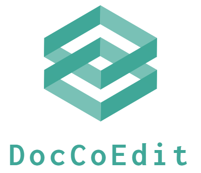
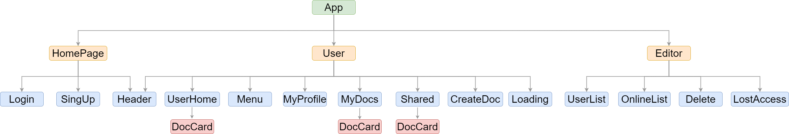

# Doc-CoEdit

    

 
Doc-CoEdit is an on-line document editor which allows you to co-edit with other in real time.
 
 

- Website : https://doc-coedit.xyz
- Test Account : Test123@gmail.com
- Password : test123
- Demo
  

# Contents

- [Main Features](#main-features)
- [Architecture](#architecture)
  - [Server Architecture](#server-architecture)
  - [Socket Architecture](#socket-architecture)
- [Backend Technique](#backend)
  - [key Points](#key-points)
  - [Deployment](#deployment)
  - [Environment/Web Framework](#environmentweb-framework)
  - [GCP Cloud Services](#gcp-cloud-services)
  - [Database](#database)
  - [Networking](#networking)
  - [Test](#test)
  - [Third Party](#third-party)
  - [Version Control](#version-control)
- [Database Schema](#database-schema)
- [Frontend](#frontend)
  - [Framework](#framework)
  - [Vue Component](#vue-component)
  - [Vue-Router](#vue-router)
  - [Pinia](#pinia)
  - [Tailwinds CSS](#tailwind-css)
  - [Third Party](#third-party-1)
  - [Version Control](#version-control-1)
- [API Doc](#api-doc)
- [Contact](#contact)

## Main Features

- Set CI/CD pipeline with GCP Cloud Build, Artifact Registry, Pub/Sub, and Cloud Function
- System
  - Users are authenticated by Jason Web Token
  - Uses Socket.io for real time co-editing
  - Supports English and Chinese
  - Supports mobile devices for updating content anywhere and anytime
  - Customizable user's profile, avatars and cover
- Document Editor
  - Only owner can grant / remove access to the document
  - Distinguish users by different cursor colors in the editor
  - Reveal online users in the document
  - Can export document to PDF file

## Architecture

### Server Architecture

### Socket Architecture

## Backend

### Key Points

- Socket.IO
- MVC pattern

### Deployment

- Docker
- Docker-Compose

### Environment/Web Framework

- Node.js / Express.js (using Typescript)

### GCP Cloud Services

- Compute Engine
- Cloud Build
- Artifact Registry
- Pub/Sub
- Cloud Function

### Database

- MongoDB Atlas

### Networking

- HTTP & HTTPS
- DNS
- SSL(Let's Encrypt)
- NGINX

### Test

- Unit Test: Jest / Sinon

### Third Party

- bcrypt.js
- passport.js
- moment.js
- joi.js

### Version Control

- Git / GitHub

## Database Schema

## Frontend

### Framework

- Vue 3 (using Typescript)

### Vue Component

### Vue-Router

- SPA routing

### Pinia

- Manage and centralize application status easily. It makes sure that any changes to the state automatically update any components that rely on that state and component is still reactivity.

### Tailwind CSS

- Easy scalability and maintenance

### Third Party

- axios
- moment.js
- i18n
- Pinia
- quill.js

### Version Control

- Git / GitHub

## API Doc

- [API Doc](https://app.swaggerhub.com/apis-docs/jerryli-ffe/doc-coedit/1.0.0#)

## Contact

👨🏻‍💻 Jian-Hung, Li
 

📬 E-mail : onigiri821130@gmail.com
